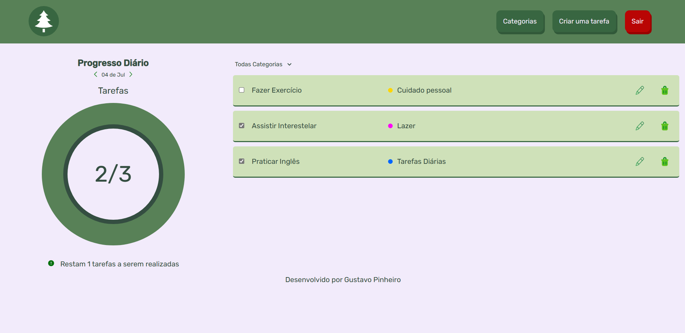
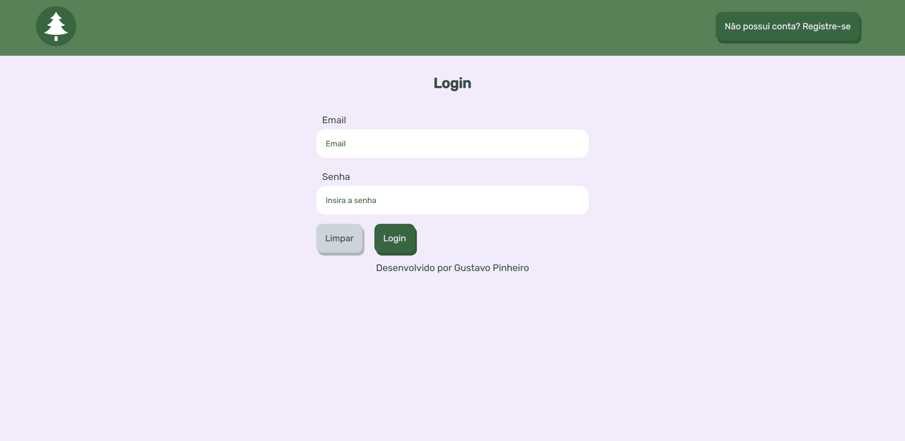
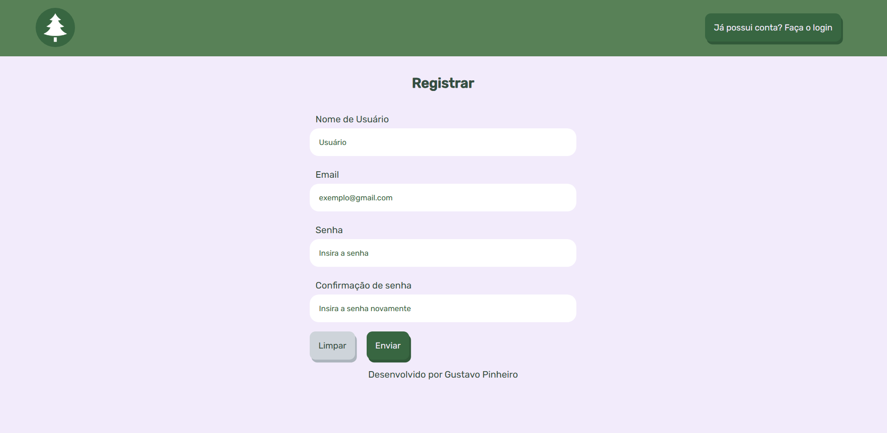

<h1 align="center"> 🌲 Pine To-Do 🌲 </h1>

<p align="center">
<a href="https://packagist.org/packages/laravel/framework"></a>
</p>
<h2 align="center"> Status: ✅ Concluído </h2>


<h2 align="center"> 📖Descrição do Projeto</h2>
O objetivo central do projeto é funcionar como um to-do list clássico, com sistema de tarefas por dia, categorias e a possibilidade de marcá-las como concluídas.


### Pré-requisitos

Antes de começar, você vai precisar ter instalado em sua máquina as seguintes ferramentas:
[Git](https://git-scm.com), [Composer](https://getcomposer.org/), [Laravel](https://laravel.com/), [MySQL](https://www.mysql.com/downloads/). 
Além disto é bom ter um editor para trabalhar com o código como [VSCode](https://code.visualstudio.com/)

### 🎲 Rodando o Back End

```bash
# Clone este repositório
$ git clone <https://github.com/tgmarinho/nlw1>

# Acesse a pasta do projeto no terminal/cmd
$ cd nlw1

# Vá para a pasta server
$ cd server

# Instale as dependências
$ npm install

# Execute a aplicação em modo de desenvolvimento
$ npm run dev:server

# O servidor inciará na porta:3333 - acesse <http://localhost:3333>

<h2 align="center">⚙️ Funcionalidades </h2>
#### ✅ Sistema de cadastro/login funcional
#### ✅ Cadastro de Tarefas
#### ✅ Cadastro de Categorias
#### ✅ Sistema de Data funcional
#### ✅ Atribuição de Tarefas e Categorias aos usuários
#### ✅ Tela dinâmica

<h2 align="center"> 🖥️ Preview </h2>
</img>
<br>
<br>
</img>
<br>
<br>
</img>


<h2 align="center"> ⚒️ Ferramentas </h2>

#### PHP
#### HTML
#### CSS
#### MySQL

